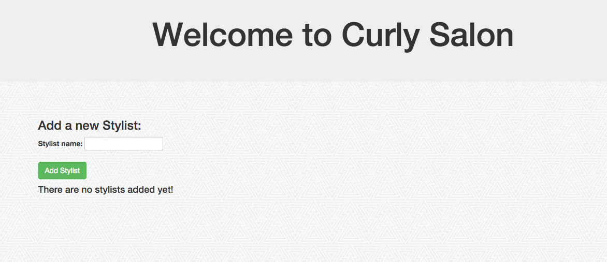

# Hair Salon Assessment

## Epicodus PHP, Week 3: Database Basics

### By: Jordan Meier

### Description

This week's code review is a website where a potential hair salon owner/manager could track their stylists and their stylists' clients using a database to store the information.



### Known Bugs

* When updating client information, the form does not seem to like apostrophes.

* There are some funky things going on with the personal stylesheet only loading on certain pages once information is submitted. Think it has something to do with routes that have more than one '/'.

### Setup

Clone this repo on to your desktop, make sure that you have Composer installed on your computer and then:
* navigate into the project folder.
* In your terminal, run the command:
```shell
composer install
```
* Once it is finished installing, navigate to the 'web' directory.
* In the 'web' directory, start the server with this command (if you are using a mac):
```shell
php -S localhost:8000
```
* Go to your browser and for the URL, type in: localhost:8000

* To access the database, in a separate terminal window, navigate to your project folder and enter:
```shell
apachectl start
```
followed by:
```shell
mysql.server start
mysql -uroot -uroot
```
* In a new window in your web browser, type in: localhost:8080/phpmyadmin

* Login and click on the import tab. Under choose file, choose the file from the project folder ending in .sql and click go.

* You can now access the hair_salon database!

* If sql file does not properly work, you can enter the following into your designated mySQL terminal:
```shell
CREATE DATABASE hair_salon;
USE hair_salon;
CREATE TABLE stylists (name VARCHAR (255), id serial PRIMARY KEY);
CREATE TABLE clients (name VARCHAR (255), phone VARCHAR (255), stylist_id INT, id serial PRIMARY KEY);
```

### Technologies Used
* html
* CSS
* PHP
* Silex
* MySQL
* Apache
* Twig
* PHPUnit
* Bootstrap v3.3.6

###Copyright & Licensing

Copyright (c) 2015 **Jordan Meier**

*This software is licensed under the MIT license.*

Permission is hereby granted, free of charge, to any person obtaining a copy
of this software and associated documentation files (the "Software"), to deal
in the Software without restriction, including without limitation the rights
to use, copy, modify, merge, publish, distribute, sublicense, and/or sell
copies of the Software, and to permit persons to whom the Software is
furnished to do so, subject to the following conditions:

The above copyright notice and this permission notice shall be included in
all copies or substantial portions of the Software.

THE SOFTWARE IS PROVIDED "AS IS", WITHOUT WARRANTY OF ANY KIND, EXPRESS OR
IMPLIED, INCLUDING BUT NOT LIMITED TO THE WARRANTIES OF MERCHANTABILITY,
FITNESS FOR A PARTICULAR PURPOSE AND NONINFRINGEMENT. IN NO EVENT SHALL THE
AUTHORS OR COPYRIGHT HOLDERS BE LIABLE FOR ANY CLAIM, DAMAGES OR OTHER
LIABILITY, WHETHER IN AN ACTION OF CONTRACT, TORT OR OTHERWISE, ARISING FROM,
OUT OF OR IN CONNECTION WITH THE SOFTWARE OR THE USE OR OTHER DEALINGS IN
THE SOFTWARE.
